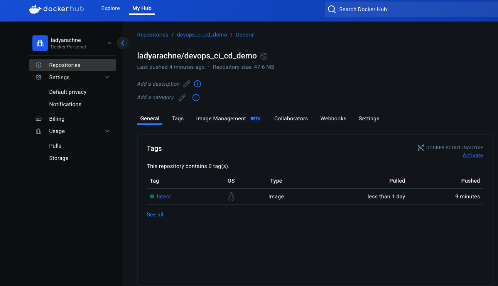

# DevOps CI/CD Demo

This project shows how to automate testing, Docker image builds, and deployment using GitHub Actions.

## 🔧 Tech Stack

- Python
- Docker
- GitHub Actions
- DockerHub

## 🚀 Pipeline

1. Run tests using pytest
2. Build Docker image
3. Push image to DockerHub

## 🖼️ Screenshots

